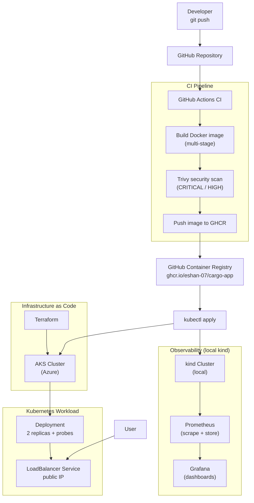

[](https://github.com/Eshan-07/k8s-pipeline-project/actions)


# k8s Pipeline Project

I built this to learn DevOps by actually doing it instead of just watching tutorials. It takes a small app and runs it through the whole lifecycle a real service goes through: container it, ship it through a CI pipeline, scan it for security issues, deploy it to Kubernetes (both locally and on a real cloud cluster), and monitor it.

The app itself is tiny on purpose — a basic FastAPI service. The point was never the app. The point was everything around it: the Docker build, the pipeline, the infrastructure, the monitoring. That's the part DevOps is actually about.

---

## What's in here

- A multi-stage Docker build that keeps the image small
- Kubernetes deployment with self-healing, health checks, and a load balancer
- A CI pipeline on GitHub Actions that builds, security-scans, and publishes the image automatically
- Trivy scanning, including a real CVE I had to track down and fix
- Terraform that spins up an actual AKS cluster on Azure
- Prometheus + Grafana for monitoring

---

## Architecture



---

## Tech stack

| Layer | Tool |
|---|---|
| Application | Python, FastAPI, Uvicorn |
| Containerization | Docker (multi-stage build) |
| Orchestration | Kubernetes (kind locally, AKS in cloud) |
| CI/CD | GitHub Actions |
| Security scanning | Trivy |
| Container registry | GitHub Container Registry (GHCR) |
| Infrastructure as Code | Terraform (azurerm provider) |
| Cloud | Microsoft Azure (AKS) |
| Observability | Prometheus, Grafana (kube-prometheus-stack via Helm) |

---

## Project structure

```
k8s-pipeline-project/
├── app/
│   ├── main.py                 # FastAPI app: /, /health, /ready
│   └── requirements.txt
├── k8s/
│   ├── deployment.yaml         # Deployment for local kind (local image)
│   ├── deployment-aks.yaml     # Deployment for AKS (GHCR image)
│   ├── service.yaml            # ClusterIP service
│   └── service-aks.yaml        # LoadBalancer service (public IP)
├── terraform/
│   ├── main.tf                 # Resource group + AKS cluster
│   ├── variables.tf
│   └── outputs.tf
├── .github/workflows/
│   └── ci.yml                  # CI: build → Trivy scan → push to GHCR
├── Dockerfile                  # Multi-stage build
├── INCIDENTS.md                # Every problem I hit and how I fixed it
├── .gitignore
└── README.md
```

---

## About the app

It's a FastAPI service with three endpoints. I picked these three on purpose because of how Kubernetes health checks work:

- `GET /` — returns the service name and version
- `GET /health` — used for the **liveness** probe (is the container alive?)
- `GET /ready` — used for the **readiness** probe (is it ready to take traffic?)

Keeping liveness and readiness separate actually matters. If liveness fails, Kubernetes restarts the container. If readiness fails, it just stops sending traffic but leaves the container alone. If you point both at the same endpoint, a slow-starting app can get killed before it ever finishes starting up — which is a real bug people hit in production.

---

## Running it

### What you need
Docker, kubectl, and kind. For the cloud parts you'll also need the Azure CLI, Terraform, and Helm.

### 1. Build the image
```bash
docker build -t cargo-app:dev .
```
The Dockerfile is multi-stage. The first stage installs the Python dependencies, and the second stage copies only the installed packages into a clean image and throws away all the build tooling. That's what keeps the final image small.

### 2. Run it on kind (local Kubernetes)
```bash
kind create cluster --name pipeline
kind load docker-image cargo-app:dev --name pipeline   # kind can't see your local Docker images
kubectl apply -f k8s/deployment.yaml
kubectl apply -f k8s/service.yaml
kubectl get pods                                        # should show 2 pods, Running, 1/1
```
You can watch the self-healing yourself — delete a pod and Kubernetes immediately makes a new one to keep the replica count at 2:
```bash
kubectl delete pod <pod-name>
kubectl get pods
```

### 3. The CI pipeline
Every push to `main` kicks off GitHub Actions, which builds the image, scans it with Trivy, and pushes it to GHCR. It's all in `.github/workflows/ci.yml`. Nothing to set up — it uses the `GITHUB_TOKEN` that Actions provides automatically.

### 4. AKS with Terraform
```bash
az login
cd terraform
terraform init
terraform plan          # dry run, shows what it would create, doesn't cost anything
terraform apply         # actually creates the cluster (this one costs money)

az aks get-credentials --resource-group rg-k8s-pipeline --name aks-pipeline
kubectl apply -f k8s/deployment-aks.yaml   # this one pulls the image from GHCR
kubectl apply -f k8s/service-aks.yaml      # LoadBalancer, gives you a public IP
kubectl get service cargo-app-lb --watch   # wait for the EXTERNAL-IP to appear

terraform destroy       # tear everything down when you're done
```
I kept the cluster as small as possible — 1 node, `Standard_B2s_v2`, free control-plane tier. Since a running cluster burns credit, I treated this as provision → deploy → check it works → destroy, all in one sitting. Don't leave it running.

### 5. Monitoring
```bash
helm repo add prometheus-community https://prometheus-community.github.io/helm-charts
helm repo update
helm install monitoring prometheus-community/kube-prometheus-stack \
  --namespace monitoring --create-namespace

kubectl port-forward -n monitoring svc/monitoring-grafana 3000:80
# then open http://localhost:3000  (login: admin)
```
The Helm chart comes with Kubernetes dashboards already built, so once you're in Grafana you can see CPU, memory, disk, and network graphs for the cluster right away.

---

## Security

Trivy runs on every build in CI and checks for CRITICAL and HIGH severity vulnerabilities.

One thing I actually ran into: Trivy flagged a denial-of-service CVE in Starlette, which is one of the app's dependencies. When I tried to bump it to the patched version, the build broke — the FastAPI version I had pinned wouldn't allow the newer Starlette. So I had to upgrade FastAPI too before the fix would go through. The rest of the findings are in the OS packages of the base image, and there's no fix released for those yet, so I documented them instead of pretending I could make them disappear. A scan that's clean today can show new CVEs tomorrow without any code changing, which is the whole reason the scan runs on every build and not just once.

For pulling the image, a production setup would use a Kubernetes `imagePullSecret`. For this project I just made the GHCR package public to keep things simple.

---

## Problems I ran into

I kept a running log of everything that broke and how I fixed it in [INCIDENTS.md](./INCIDENTS.md). A few of the more interesting ones:

- **A dependency conflict while patching a CVE** — couldn't upgrade Starlette on its own because FastAPI was pinning an older version, so I had to upgrade the parent package too.
- **A VM size that wasn't available** — my Azure region didn't allow the VM size I picked. The error listed the ones it did allow, and because Terraform is idempotent I just changed the size and re-applied without any mess.
- **"No subscriptions found" on Azure login** — turned out my student subscription was fine; the real issue was a tenant that needed MFA.
- **Pods stuck on ImagePullBackOff** — kind has its own separate image store, so you have to explicitly load images into it instead of assuming it can see your local Docker.

---

## What I took away from this

- The app is the easy part. The real work, and the actual skill, is everything around it — the pipeline, the infrastructure, the monitoring.
- Most of Kubernetes makes sense once you get one idea: it constantly compares what you said you want against what's actually running and fixes the difference. Self-healing, scaling, rolling updates all come from that.
- A lot of "broken" turned out to be something simple I'd assumed instead of checked — was the file actually there, was the service running, was the tool on PATH. Reading the error literally got me unstuck faster than guessing every time.
- Security and infrastructure aren't things you finish. You keep maintaining them.
